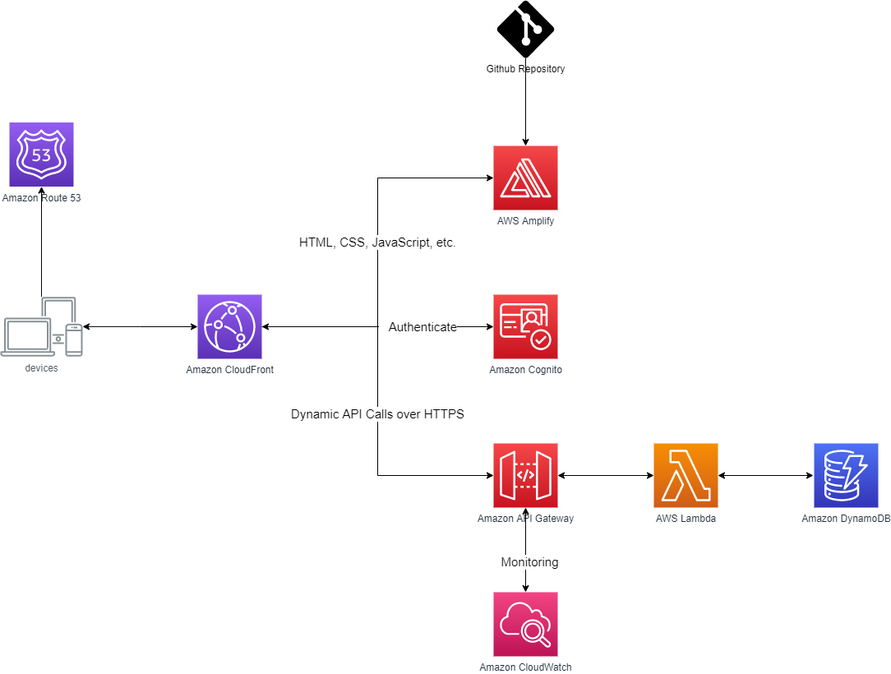

# aws-thermostat-demo
A thermostat demo built on AWS

## Architeture



## Build & Deploy
```cmd
sam build --use-container -p
sam deploy --stack-name $STACK_NAME
```

## Local test


Configure globals
```bash
export AWS_DEFAULT_REGION=<your preferred region, i.e. us-east-1>
export STACK_NAME=<a unique name for your CloudFormation stack>
```

```bash
set AWS_DEFAULT_REGION　us-west-2
set STACK_NAME thermostat-demo
```


To run the dynamodb table locally

```bash
docker run -p 8000:8000 amazon/dynamodb-local
```

Create local dynamodb table
```bash
aws dynamodb create-table --table-name thermostat-table --attribute-definitions AttributeName=id,AttributeType=S --key-schema AttributeName=id,KeyType=HASH --billing-mode PAY_PER_REQUEST --endpoint-url http://127.0.0.1:8000
aws dynamodb create-table --table-name log-table --attribute-definitions AttributeName=id,AttributeType=S --key-schema AttributeName=id,KeyType=HASH --billing-mode PAY_PER_REQUEST --endpoint-url http://127.0.0.1:8000
aws dynamodb create-table --table-name ThermostatTable --attribute-definitions AttributeName=id,AttributeType=S --key-schema AttributeName=id,KeyType=HASH --billing-mode PAY_PER_REQUEST --endpoint-url http://127.0.0.1:8000
```

List local dynamodb tables
```bash
aws dynamodb list-tables --endpoint-url http://127.0.0.1:8000
```


Delete local dynamodb table
```bash
aws dynamodb delete-table --table-name thermostat-table  --endpoint-url http://127.0.0.1:8000
```

Write item
```bash
aws dynamodb put-item  --table-name thermostat-table  --item '{\"cognito_username\": {\"S\": \"Test User\"},\"id\":{\"S\":\"57f34e00-2751-11ec-826e-a5bc87271450\"}}' --endpoint-url http://127.0.0.1:8000
```

Get item
```bash
aws dynamodb get-item --table-name thermostat-table --key '{\"id\":{\"S\":\"57f34e00-2751-11ec-826e-a5bc87271450\"}}' --endpoint-url http://127.0.0.1:8000
```

Query item
```bash
aws dynamodb query --table-name thermostat-table --key-condition-expression "id = :id"  --expression-attribute-values  '{\":id\":{\"S\":\"57f34e00-2751-11ec-826e-a5bc87271450\"}}' --endpoint-url http://127.0.0.1:8000
```

Generate events
```bash
sam local generate-event apigateway aws-proxy --method GET --resource thermostat --path thermostats > event.json
```

Test 
Get all
```bash
sam local invoke GetAllThermostatsFunction -e .\backend\getAllThermostat\event.json
```

Get one item
```bash
sam local invoke GetThermostatFunction -e .\backend\getThermostat\event.json
```

Add
```bash
sam local invoke AddThermostatFunction -e .\backend\addThermostat\event.json
```

##　Troubleshooting 
[ERROR] Missing AWS Lambda trace data for X-Ray. Ensure Active Tracing is enabled and no subsegments are created outside the function handler.
Add "X-Amzn-Trace-Id": "Root=1-5dc86974-035ac025a456001d3ac4b6cb;Sampled=1" in headers in event.json